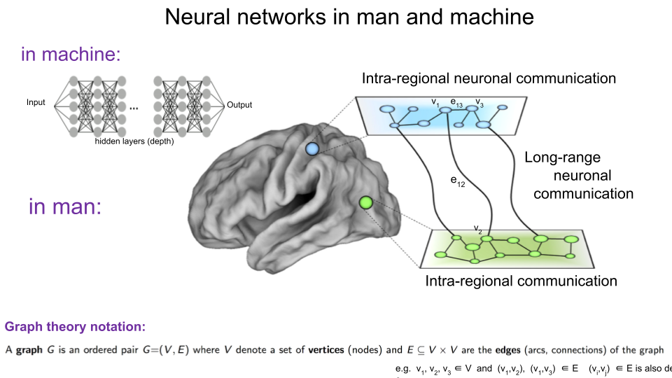

# In Vivo Imaging and Physiological Modelling - BMED 360 

## Lab6-Networks-Graphs

- [**01-Concepts-in-network-theory.ipynb**](https://nbviewer.jupyter.org/github/computational-medicine/BMED360-2021/blob/main/Lab6-Networks-Graphs/01-Concepts-in-network-theory.ipynb) 

- [**02-Network-based-statistics.ipynb**](https://nbviewer.jupyter.org/github/computational-medicine/BMED360-2021/blob/main/Lab6-Networks-Graphs/02-Network-based-statistics.ipynb) 

- [**03-Resting-state-fmri-explore.ipynb**](https://nbviewer.jupyter.org/github/computational-medicine/BMED360-2021/blob/main/Lab6-Networks-Graphs/03-resting-state-fmri-explore.ipynb) 

- [**Brain connectivity and fMRI**](Connectivity-fMRI.md)

<!--

<iframe width="560" height="315" src="https://www.youtube.com/embed/rAbNbpcUNdY" 
frameborder="0" allow="accelerometer; autoplay; encrypted-media; gyroscope; picture-in-picture" allowfullscreen>
</iframe>

 
 
-->

Video from the lecture on _Networks, Graphs, fMRI and brain connectivity_: 

---------------- Recorded from the Zoom meeting 2021-05-10 ----> 

 

See also **Neural Networks hands-on** by Peder Lillebostad at the [CBM101](https://github.com/oercompbiomed/CBM101) [_Open Educational Resources in Computational Biomedicine_](https://ec.europa.eu/programmes/erasmus-plus/projects/eplus-project-details/#project/bc4e0bdb-aa64-4d5c-a7f2-26d68ec36647) site:  https://github.com/oercompbiomed/CBM101/tree/master/H_Neural_Networks

### Additional reading:

Barabasi, AL, Gulbache N, Loscalzo J. Network medicine: a network-based approach to human disease https://barabasi.com/f/320.pdf

Hu JX, Thomas CE, Brunak S. Network biology concepts in complex disease co-morbidities. https://www.nature.com/articles/nrg.2016.87

Barabasi AL, Oltvai ZN. Network biology: understanding the cell's functional organization. https://www.nature.com/articles/nrg1272

---------------------

# Afternotes 

(Adapted from Merja Heinäniemi / Sylvain Tollis  and the _Introduction to Computational Biomedicine and Machine Learning_ course [CBM101](https://github.com/oercompbiomed/CBM101))

### Network analysis

- https://github.com/oercompbiomed/CBM101/blob/master/D_Network_analysis/assets/p1.md
- https://github.com/oercompbiomed/CBM101/blob/master/D_Network_analysis/assets/p2.md

### Descriptive vs predictive biological sciences, systems-level analysis and predictive quantitative modeling of biological systems

As a fundamental science, the purpose of biology is to describe nature and to understand how natural things work together. The purpose of biomedicine is to prevent and/or cure diseases caused by failures in the natural biological order. Hence, a biomedical expert has a completely different task: to predict how the biological system will respond to a (pharmacological) perturbation. This is analogous to the fundamental difference between a physicist, whose role is to understand and describe the physical laws underlying the natural order, and an engineer whose role is to use these laws to build an airplane that do actually fly. Hence, the engineer has to be able to quantitatively predict how the lift force that keeps the plane from falling down will respond to pressure, temperature or air fluxes changes during the flight, and to make sure that how the wings are designed optimizes this lift force. The problem faced in biomedicine is similar, yet the underlying laws that govern cell biology are poorly documented. 

As illustrated in the Introduction, describing a cell biological system, even with the finest resolution, is insufficient to predict how it will respond to pharmacological perturbation. The correct language to make predictions is mathematics. 1000s of Newtons could have observed and documented millions of apples falling from apple trees: without the mathematical formulation of the Newton’s law of universal gravitation (Force proportional to mass1 times mass2 over distance squared), we would still be unable to predict how to tune satellites launching parameters to reach a geostationary orbit and there would be millions of useless telecom satellites all over the place in the solar system. 

### Quantitative biomedicine
So we have to describe cells with numbers and connect these numbers with relationships/equations (you mean, building a network of numbers???), in order to predict how modifying some numbers affect others in a way that could be accurately measured in well-controlled experiments, to check if our equations are correct. It’s not an easy task: Newton’s law was validated experimentally more than a century after it was first published. But it’s a no-brainer. But we know how to measure numbers in cells, at least some of them, as described throughout this course. That’s already a good start. 
But which numbers shall we measure? Biomedical systems are made of cells, cells of organelles, organelles of molecules, molecules of atoms …etc. So, cell biology integrates a broad range of length-scales. 1) let’s measure lengths. Several other parameters are related to (cellular) geometry, like protein size and shape, organelles volume or surface, surface to volume ratio, shapes, bending curvature…  Biomedical processes are regulated by almost instantaneous chemical reactions (nano- to micro-seconds), fast signals (seconds to minutes), but sometimes spread over the entire lifespan of an organism (decades). So, cell biology integrates a broad range of time-scales. 2) let’s measure times. Several other parameters are related to time-scales, such as the biochemical reaction rates, synthesis/degradation rates, biological molecule stability. Other cellular parameters connect the space and time components, such that protein diffusion, vesicular transport, or even cytoskeleton dynamics and scaffolds remodeling that modify geometrical constraints through time. Finally, remembering that limiting factors can be important in cellular responses, it seems obvious that we need to figure out which factors are limiting. Hence, we need to count cellular objects, proteins, RNA molecules, energy reserves, metabolites, lipid vesicles, cytokines, chemokines, cell-cell communication molecules … , and measure how these counts vary in space and time. Other key parameters are related to objects “counts” (and/or concentrations), like dissociation constants for molecular interactions (Kds), biochemical reaction rates (again!)…  In addition, are all these cellular numbers constants? Are they modulated? If yes, how?  This list is certainly not exhaustive. Why should it be? As we’ll see next, which numbers to measure and study depends on the particular predictions we want to make. 

  <a href="./assets/p1.md">   Mathematical models    </a> •
  <a href="./assets/p2.md">   Model parameters    </a> •

