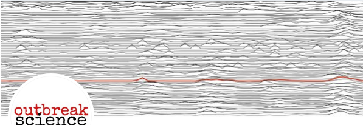

# In Vivo Imaging and Physiological Modelling - BMED 360 Spring 2021

# Ad hoc curriculum on COVID-19 and "outbreak science" - _epi_
(work in progress)

#### We will keep substantial parts of the original curriculum (see [README](../README.md)), and extend those components that relates to "outbreak science", e.g. _the concept of modeling_, _diffusion_, _tracer kinetics_, _network science & graph theory_, ..., every topic supported by Jupyter notebooks (see below) - with programming exercises and challenges.

## Reading material and learning opportunities

- Kermack WO, McKendrick AG. A Contribution to the Mathematical Theory of Epidemics. Proceedings of the Royal Society of London. Series A. 1927;115(772):700-721 [[link](https://royalsocietypublishing.org/doi/pdf/10.1098/rspa.1927.0118)] (the SIR model being introduced)

**ABSTRACT**  [source: [The Royal Society Publishing](https://royalsocietypublishing.org/doi/10.1098/rspa.1927.0118)] 
One of the most striking features in the study of epidemics is the difficulty of finding a causal factor which appears to be adequate to account for the magnitude of the frequent epidemics of disease which visit almost every population. It was with a view to obtaining more insight regarding the effects of the various factors which govern the spread of contagious epidemics that the present investigation was undertaken. Reference may here be made to the work of Ross and Hudson (1915-17) in which the same problem is attacked.
The problem is here carried to a further stage, and it is considered from a point of view which is in one sense more general.

The problem may be summarised as follows: One (or more) infected person is introduced into a community of individuals, more or less susceptible to the disease in question. The disease spreads from the affected to the unaffected by contact infection. Each infected person runs through the course of his sickness, and finally is removed from the number of those who are sick, by recovery or by death. The chances of recovery or death vary from day to day during the course of his illness. The chances that the affected may convey infection to the unaffected are likewise dependent upon the stage of the sickness. As the epidemic spreads, the number of unaffected members of the community becomes reduced. Since the course of an epidemic is short compared with the life of an individual, the population may be considered as remaining constant, except in as far as it is modified by deaths due to the epidemic disease itself. In the course of time the epidemic may come to an end.

One of the most important probems in epidemiology is to ascertain whether this termination occurs only when no susceptible individuals are left, or whether the interplay of the various factors of infectivity, recovery and mortality, may result in termination, whilst many susceptible individuals are still present in the unaffected population. It is difficult to treat this problem in its most general aspect. In the present communication discussion will be limited to the case in which all members of the community are initially equally susceptible to the disease, and it will be further assumed that complete immunity is conferred by a single infection.

- Wikipedia: [Compartment models in epidemiology](https://en.wikipedia.org/wiki/Compartmental_models_in_epidemiology) (the SIR model explained)

- **COVID-19 Learning Opportunities from Johns Hopkins** 
  - [Fighting COVID-19 with Epidemiology: A Johns Hopkins Teach-Out](https://www.coursera.org/learn/covid19-epidemiolog)
  
- **Mathemtics of life and death: How disease models shape national shutdowns and other pandemic policies** Science (news) March 25 2020
 by M Enserink & K Kupferschmidt [[link](https://www.sciencemag.org/news/2020/03/mathematics-life-and-death-how-disease-models-shape-national-shutdowns-and-other)]
