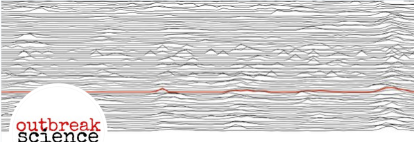

# In Vivo Imaging and Physiological Modelling - BMED 360 Spring 2021

# Ad hoc curriculum on COVID-19 and "outbreak science" - _img_
(work in progress)

#### We will keep substantial parts of the original curriculum (see [README](../README.md)) and extend those components that relates to "outbreak science", e.g. _the concept of modeling_, _diffusion_, _tracer kinetics_, _network science & graph theory_, _optimization_ ..., every topic supported by Jupyter notebooks - with programming exercises and challenges.

## Reading material and Learning opportunites

- **Radiology fighting Covid-19 - Live report from Parma, Italy** A special report by the European Society of Radiology (ESR) dedicated to radiology fighting COVID-19. In an expert interview with Prof. Nicola Sverzellati from the University of Parma, Italy, he will share insights on the experience of patient and imaging management in Europe's currently most affected area (thanks for the link Sathiesh)
[[YouTube](https://www.youtube.com/watch?v=QFW8CmZ0cyM)]

- **Brain images may show 'cytokine storm' from COVID-19** Yee KM [AuntMinnie.com](https://www.auntminnie.com/index.aspx?sec=sup&sub=cto&pag=dis&ItemID=128609) (1 Apr 2020) and Poyiadji N et al. Radiology (31 Mar 2020) [[online](https://pubs.rsna.org/doi/10.1148/radiol.2020201187)] [[pdf](https://pubs.rsna.org/doi/pdf/10.1148/radiol.2020201187)] 
"Accumulating evidence suggests that a subgroup of patients with severe COVID-19 might have a [cytokine storm](https://en.wikipedia.org/wiki/Cytokine_release_syndrome) syndrome", where "The most characteristic imaging feature includes symmetric, multifocal lesions with invariable thalamic involvement. Other commonly involved locations include the brain stem, cerebral white matter, and cerebellum."
 
MRI images demonstrate T2 FLAIR hyperintensity within the bilateral medial temporal lobes and thalami (A, B, E, F) with evidence of hemorrhage indicated by hypointense signal intensity on susceptibility-weighted images (C, G) and rim enhancement on postcontrast images (D, H). [[Ref](https://pubs.rsna.org/doi/10.1148/radiol.2020201187)]

