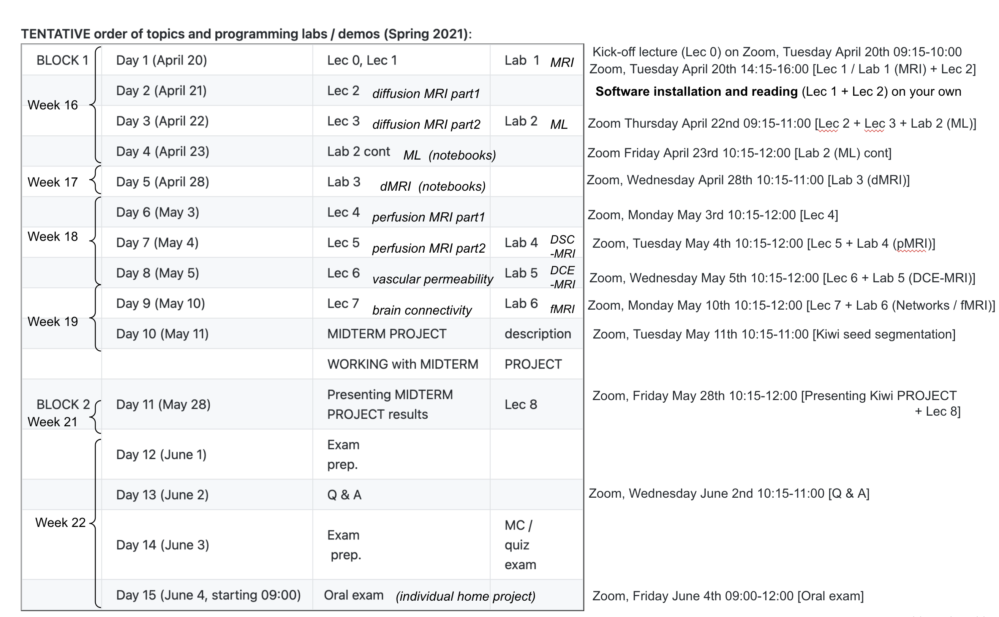
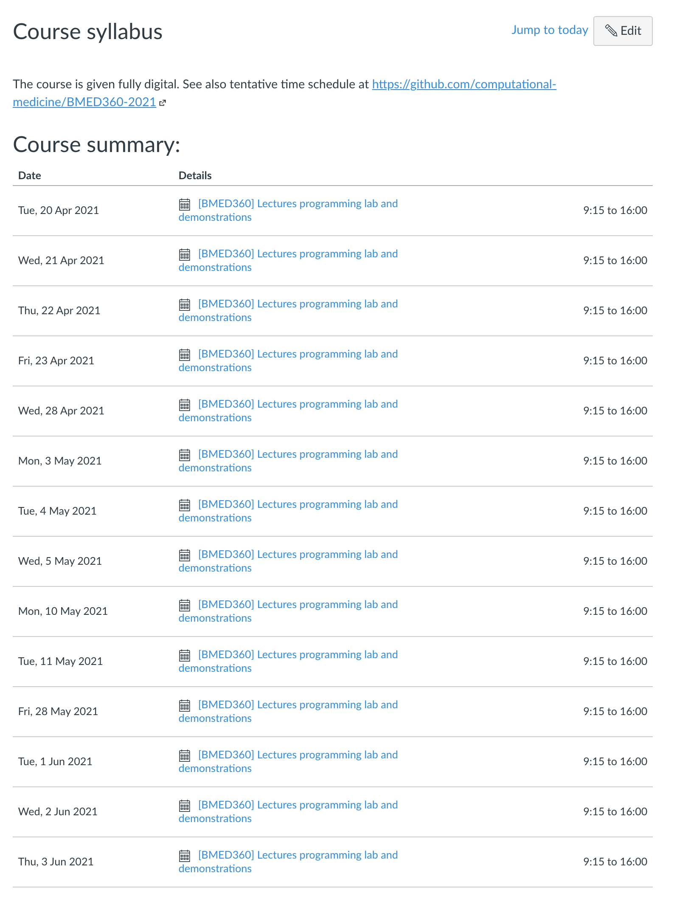

# In Vivo Imaging and Physiological Modelling - BMED 360 Spring 2021

## ( with [_ad hoc_](https://github.com/computational-medicine/BMED360-2021/tree/main/Outbreak-Science-Extra#readme) curriculum* on COVID-19 and "outbreak science" )

[Work in progress ver. 2021-05-10]

This is the repository for the course [BMED360](https://www.uib.no/en/course/BMED360) given at the Department of Biomedicine 

Biomedicine covers those areas of human biology, chemistry and medicine that seek to explain the factors behind health and disease at the molecular and cellular level. This information is applied in the development of better diagnostics and treatments. 

In this repository you find presentations, documentation, code, and partly data for the course.

The goal of this course is to obtain theoretical and practical knowledge on functional and quantitative in vivo imaging in man and animal using magnetic resonance imaging (MRI) and computer-based image analysis. The focus is on brain imaging (perfusion, diffusion, permeability mapping) and structural and functional connectivity, but also examples from functional kidney imaging and (image-based) systems biology will be presented. A major objective is also to give insight about the importance of mathematical models and computations in analysis and understanding of complex physiological processes, and the need of cross-disciplinary collaborations.

***)  We plan to run BMED 360 (_n_ students enrolled) starting Tuesday April 20 ("fully digitized") with a slightly modified curriculum, also addressing COVID-19 and "outbreak science" from a computional imaging and modeling perspective. There will be online slides, computer labs (code and data on GitHub,  using `Discussions` for student interaction), assignments/challenges, digital MCQ, and a final digital oral exam from home (presenting yor personal project on Zoom - taking load from MittUiB, being mostly used for static information). Grading has been A-F, this semester we will use pass/nopass.  NOTE: This is work <u>IN PROGRESS</u> . . .**

You will find more (static) information about this course at [MittUiB](https://mitt.uib.no/courses/27782)

# Setting up your system (preparations for the course)

**Follow the instructions at [Setting up your system](setup.md) (`setup.md`) to get ready**

### Browser
- Display and functionality might differ between browsers - we recommend using Google [Chrome](https://www.google.com/chrome) on all platforms

# Notebooks
The course is based on the Jupyter Notebook, a web-based framework for developing and presenting code-based projects (take a look at https://youtu.be/HW29067qVWk og https://youtu.be/2eCHD6f_phE for introductions to Jupyter Notebooks).

### Google Collaboratory (Colab)
This repository is also available on Google Colaboratory ([Colab](https://research.google.com/colaboratory/faq.html)): http://colab.research.google.com/github/computational-medicine/BMED360-2021. See also the individual Jupyter notebooks for execution on Colab - a hosted Jupyter notebook service that requires no setup to use, while providing free access to computing resources including GPUs.

### IMPORTANT (for making your own notebooks for coding experiments without conflict)
Throughout the course you will work with notebooks that contain various material and programming tasks. We recommend that you *make a copy of our notebooks before you are editing them*. In this respect you might adopt the naming convention `my_[name_of_notebook].ipynb`. Remember also to start a new session with a **`git pull`** (things can have changed).

## Get started - test your environment
* [Python, Numpy, Pandas, Matplotlib, Nibabel, Biopython and more](./Test-Notebook/0.0-test-installation.ipynb): run through this notebook (`Test-Notebook/`[0.0-test-installation.ipynb](https://nbviewer.jupyter.org/github/computational-medicine/BMED360-2021/blob/main/Test-Notebook/0.0-test-installation.ipynb)) to check that your environment is OK. 

## Major topics in the "In Vivo Imaging and Physiological Modelling" course:

**LECTURES**:

- **[Lec 0](https://docs.google.com/presentation/d/1aoNyjXZ053yCUbdY5YVAtftGL2yym10QmbnnrlNFr7A/edit?usp=sharing): Course overview; [SW installation](setup.md); Motivation:** [Can a biologist fix a radio?](https://www.cell.com/cancer-cell/pdf/S1535-6108(02)00133-2.pdf) Lazebnic (2002); [Why programming?](https://drive.google.com/file/d/1Zss5kTEgVmoF8PxQpho2yvfNviJOksgv); Why top-down? - [teaching "the whole game"](https://www.fast.ai/2016/10/08/teaching-philosophy) (see also https://computingskillsforbiologists.com)
- **[Lec 1](https://docs.google.com/presentation/d/1fZEID0NKFBdtMsQgzMuNwpvaUa-y7LAIihpap0Y3Q20/edit?usp=sharing)**: _Introduction to modelling, MRI, and image processing_;  **BROWSE through**: [Tofts (2018) Ch. [1](https://drive.google.com/open?id=1s36p4vEXEEfmL3KZqMaHkbu4e58XMgDj), Ch. [2](https://drive.google.com/open?id=1zWhdLIzTFsk92a-XLWj7eW8pHmDs5VEG), Ch. [17](https://drive.google.com/open?id=19U76zBL2ZQrRnhUT-s_GpFzPM29WpJLB), Ch. [18](https://drive.google.com/open?id=1t9vUUJ6Xc4zmCdCjwNJuqhZHo_CV06ad);  McRobbie (2017) Ch. [3](https://drive.google.com/open?id=1igDMEVAnWR3kU1doXTz_X-LygdVLQovJ), Ch. [4](https://drive.google.com/open?id=15_9lHA_6DXZHhQEXH2T-VLNDbV16A1zo), Ch. [5](https://drive.google.com/open?id=14TGT59koVT6ujgYNDwK5G5xOA3LFlcSI), Ch. [8](https://drive.google.com/open?id=1CiCRAslFUb5Q3DZqpbEhkdBJm57vQx4O)]
- **[Lec 2](https://docs.google.com/presentation/d/1qMxwu401az5zgq6Rg5M7kOtygdeosnMeSucvy7SSbNk/edit?usp=sharing)**: _Water diffusion_, dMRI, and tissue microstructure - Part 1 [Tofts (2018) Ch. [8](https://drive.google.com/open?id=1rck9B5qsW0uV49D9588HolNLCRm7g9jy); McRobbie (2017) Ch. [18](https://drive.google.com/open?id=1kAUzG30nGN4a9pPq45jH6pIHPU0EKwyC) pp. 303-310]. Video recording from the dMRI session: https://youtu.be/ZkVclYejv54
- **[Lec 3](https://docs.google.com/presentation/d/1pcFZO9H3EOrB3rYgUuIjd9Ja_UfMWjULH8wSZcOYDbw/edit?usp=sharing)**: _Water diffusion_, diffusion tensor imaging and beyond - Part 2 [Tofts (2018) Ch. [9](https://drive.google.com/open?id=1ZRfd4iI8q0VmfuEzPVwgkhlHawvrglf3); [Westin (2002)](https://drive.google.com/open?id=1WkAbJi3Xh4sdDdBMiu9yuXEU9UzGKKSs)]
- **[Lec 4](https://docs.google.com/presentation/d/1C0WGl1qKrQdwrMKOMfWyTnnASLzECRKhvLhZozphJwQ/edit?usp=sharing)**: _Blood perfusion_ and dynamic susceptibility contrast MRI (DSC-MRI) - Part 1  [Tofts (2003) Ch. [11](https://drive.google.com/open?id=1DWhL0B8xGc1EL1Ag7J4I2iCMBdHl-2mA); McRobbie (2017) Ch. [18](https://drive.google.com/open?id=1kAUzG30nGN4a9pPq45jH6pIHPU0EKwyC) pp. 311-314]. Video recording from this session: https://youtu.be/h1AboyMq7Uw
- **[Lec 5](https://docs.google.com/presentation/d/1CTuA2tBCBQaWHL7_k2o0o26E8Lp6G4UaNjlL1y2Qsac/edit?usp=sharing)**: _Blood perfusion_, tracer kinetics, and deconvolution - Part 2  [Tofts (2003) Ch. [11](https://drive.google.com/open?id=1DWhL0B8xGc1EL1Ag7J4I2iCMBdHl-2mA)]. Video recording from thos session: https://youtu.be/mTCs2MFxEzk
- **[Lec 6](https://docs.google.com/presentation/d/1EYuKHtQM4RIgkvIxrMyAkq02l8KUd9WuCsjCHviBaKI/edit?usp=sharing)**: _Vascular permeability_, compartment modelling, and T1w dynamic contrast-enhanced MRI (DCE-MRI) [Tofts (2018) Ch. [14](https://drive.google.com/open?id=1Wy6ZGurLkV18q6v1XAlhMRfvLttV2f08); McRobbie (2017) Ch. [18](https://drive.google.com/open?id=1kAUzG30nGN4a9pPq45jH6pIHPU0EKwyC) pp. 316-319; Measurement of Renal Perfusion and Filtration with MRI [GitHub](https://github.com/arvidl/functional-kidney-imaging) / [slides](https://docs.google.com/presentation/d/1WS6ODHrXOfYL-fXLw847EkYR4qcvDJA6bRTvqFE_fIY/edit?usp=sharing)]. Video recording from this session:  https://youtu.be/X4zGyhid48U
- **[Lec 7](https://docs.google.com/presentation/d/142Y5wQKkIvRkcmBiSV2INDhuMdRHrpPhxqs2zx17ZCY/edit?usp=sharing)**: _Brain connectivity_ assessed with aMRI, dMRI, fMRI and network (graph) theory  [Fornito (2016) Ch. [1](https://drive.google.com/open?id=179E3CAZsV6LzV7Jb37eHmczuzVLJUB4H); [Bassett (2018)](https://drive.google.com/open?id=1PW30HroQMBLPLDiZsnhJZ-obumW5RaEA); McRobbie (2017) Ch. [18](https://drive.google.com/open?id=1kAUzG30nGN4a9pPq45jH6pIHPU0EKwyC) pp. 319-325]. Video recording from this session: https://youtu.be/rAbNbpcUNdY
- **Lec 8**: _Outbreak science and COVID-19_ [[README](https://github.com/computational-medicine/BMED360-2021/tree/main/Outbreak-Science-Extra#readme)] (biology, epidemiology, geo-mapping, imaging) [[covid-19-eda](https://nbviewer.jupyter.org/github/computational-medicine/BMED360-2021/blob/main/Outbreak-Science-Extra/epi/covid-19-eda.ipynb)] [[simulitis-outbreak](https://nbviewer.jupyter.org/github/computational-medicine/BMED360-2021/blob/main/Outbreak-Science-Extra/epi/simulitis-outbreak.ipynb)]

**LABS**:

- **Lab 0** (before the course): [**SW installation**](setup.md) and **Beginner's guides** 
   - [[README](https://github.com/computational-medicine/BMED360-2021/tree/main/Lab0-beginners-guide#readme)]
   - [[Lab0-00-begin-python-programming-language](https://github.com/computational-medicine/BMED360-2021/blob/main/Lab0-beginners-guide/00-begin-python-programming-language.ipynb)] (operators, control structures, lists, dictionaries, and more ...)
   - [[Lab0-01-jupyter-notebook-markdown-basics](https://github.com/computational-medicine/BMED360-2021/blob/main/Lab0-beginners-guide/01-jupyter-notebook-markdown-basics.ipynb)] (how to use the rich functionality of [_Markdown Cells_](https://jupyter-notebook.readthedocs.io/en/latest/examples/Notebook/Working%20With%20Markdown%20Cells.html) in Jupyter notebooks)
   - [[Lab0-02-begin-pandas-basics](https://github.com/computational-medicine/BMED360-2021/blob/main/Lab0-beginners-guide/02-begin-pandas-basics.ipynb)] (likely the most important data analysis and manipulation tool for Python)
   - [[Lab0-03-begin-image-processing-basics](https://github.com/computational-medicine/BMED360-2021/blob/main/Lab0-beginners-guide/03-begin-image-processing-basics.ipynb)] (relevant for the [Midterm-Kiwi-Project](./Midterm-Kiwi-Project#readme))
   -  (and optionally, [Prog4comp-SL-HPL-Extra](./Prog4comp-SL-HPL-Extra) for those who want to go deeper into numerical computing and simulations)
- **Lab 1**: **Data analysis, image processing, and modelling in Python**
  - [[README](https://github.com/computational-medicine/BMED360-2021/tree/main/Lab1-MRI#readme)]
  - [[Lab1-00-get-mri-imc-data](https://nbviewer.jupyter.org/github/computational-medicine/BMED360-2021/blob/main/Lab1-MRI/00-get-mri-imc-data.ipynb)] (download MRI data and IMC ([_Imaging Mass Cytometry_](https://www.fluidigm.com/applications/imaging-mass-cytometry)@FLUIDIGM) data used in this Lab1)
  - [[Lab1-01-mri-intro](https://nbviewer.jupyter.org/github/computational-medicine/BMED360-2021/blob/main/Lab1-MRI/01-mri-intro.ipynb)]
  - [[Lab1-02-mri-multispectral](https://nbviewer.jupyter.org/github/computational-medicine/BMED360-2021/blob/main/Lab1-MRI/02-mri-multispectral.ipynb)] 
  - [[Lab1-03-mri-snr-cnr](https://nbviewer.jupyter.org/github/computational-medicine/BMED360-2021/blob/main/Lab1-MRI/03-mri-snr-cnr.ipynb)]
  - [[Lab1-04-imc-intro](https://nbviewer.jupyter.org/github/computational-medicine/BMED360-2021/blob/main/Lab1-MRI/04-imc-intro.ipynb)]
- **Lab 2**: **Machine learning, multispectral imaging and tissue classification**
  - [[README](https://github.com/computational-medicine/BMED360-2021/tree/main/Lab2-ML-tissue-classification#readme)]
  - [[Lab2-00-recap-python](https://nbviewer.jupyter.org/github/computational-medicine/BMED360-2021/blob/main/Lab2-ML-tissue-classification/00-recap-python.ipynb)]
  - [[Lab2-01-intro-example](https://nbviewer.jupyter.org/github/computational-medicine/BMED360-2021/blob/main/Lab2-ML-tissue-classification/01-intro-example.ipynb)]
  - [[Lab2-02-extensive-example](https://nbviewer.jupyter.org/github/computational-medicine/BMED360-2021/blob/main/Lab2-ML-tissue-classification/02-extensive-example.ipynb)] 
  - [[Lab2-03-advanced-dl-example](https://nbviewer.jupyter.org/github/computational-medicine/BMED360-2021/blob/main/Lab2-ML-tissue-classification/03-advanced-dl-example.ipynb)] (requires the [`fastai`](https://docs.fast.ai) kernel)
  - [[Lab2-04-mri-knn-tissue-classification](https://nbviewer.jupyter.org/github/computational-medicine/BMED360-2021/blob/main/Lab2-ML-tissue-classification/04-mri-knn-tissue-classification.ipynb)] 
  - [[Lab2-05-mri-kmeans-tissue-classification](https://nbviewer.jupyter.org/github/computational-medicine/BMED360-2021/blob/main/Lab2-ML-tissue-classification/05-mri-kmeans-tissue-classification.ipynb)]
- **Lab 3**: **Processing of diffusion MRI (dMRI / DTI)**  [[DIPY](https://dipy.org)]  
  - [[README](https://github.com/computational-medicine/BMED360-2021/tree/main/Lab3-diffusion-MRI#readme)] 
<!--
  - [[01-diff](./diffusion/01-diff-random-walks.ipynb)] 
  - [[02-diff](./diffusion/02-diff-dipy-S0s.ipynb)] 
  - [[03-diff](./diffusion/03-diff-dipy-find-affine-brainmask2dwi.ipynb)] 
  - [[04-diff](./diffusion/04-diff-dipy-reconstruction-dti.ipynb)] 
  - [[05-diff](./diffusion/05-diff-dipy-do-affine-reg-anat2dwi.ipynb)] 
  - [[06-diff](./diffusion/06-diff-dipy-dti-feature-extraction-roi-wise.ipynb)]
--->
- **Lab 4**: **Processing of perfusion MRI (pMRI / DSC-MRI)**  
  - [[README](https://github.com/computational-medicine/BMED360-2021/blob/main/Lab4-perfusion-MRI#readme)] 
- **Lab 5**: **Vascular permeability mapping (DCE-MRI)** 
  - [[README](https://github.com/computational-medicine/BMED360-2021/tree/main/Lab5-DCE-MRI#readme)]
- **Lab 6**: **Network science and Graphs**
  - [[README](https://github.com/computational-medicine/BMED360-2021/tree/main/Lab6-Networks-Graphs#readme)]
  - [[Lab6-01-Concepts-in-network-theory](https://nbviewer.jupyter.org/github/computational-medicine/BMED360-2021/blob/main/Lab6-Networks-Graphs/01-Concepts-in-network-theory.ipynb)]  
  - [[Lab6-02-Network-based-statistics](https://nbviewer.jupyter.org/github/computational-medicine/BMED360-2021/blob/main/Lab6-Networks-Graphs/02-Network-based-statistics.ipynb)]
  - [[Lab6-03-resting-state-fmri-expore](https://nbviewer.jupyter.org/github/computational-medicine/BMED360-2021/blob/main/Lab6-Networks-Graphs/03-resting-state-fmri-explore.ipynb)]
  - [[Connectivity-fMRI](./Lab6-Networks-Graphs/Connectivity-fMRI.md)] (brain connectivity and fMRI -  concepts, software, and data)

**ASSESSMENT / EXAM**:

- **Midterm assignment**: [[The KIWIfruit segmentation challenge](./Midterm-Kiwi-Project/README.md)]
- **MCQ / Quiz**: [[README](./Assessment-BMED360/README.md)]
- **Oral presentation of PROJECT**: [[README](./Assessment-BMED360/README.md)]

**Previous course material**
- [Previous (2019) LECTURES](https://sites.google.com/site/bmed360/courses) and
- [Previous (2019) LABS](https://sites.google.com/site/bmed360/labs)
- [Previous (2020) GitHub repository](https://github.com/computational-medicine/BMED360-2020)

**Q&A topics** (from 2019 - still relevant) [[gslides](https://docs.google.com/presentation/d/1-9HeVb1ewBLVVxcrh2-JRnepcPxPisZW_tgSfYVYp54/edit?usp=sharing)]

## Tentative schedule (fully digital, lectures on Zoom) Spring 2021

<!--

&nbsp;

<strong>TENTATIVE order of topics and programming labs / demos (Spring 2021)</strong>:

<table border="1" cellspacing="0">
<tbody>
<tr>
<td>&nbsp;BLOCK 1</td>
<td>&nbsp;Day 1 (April 20)</td>
<td>&nbsp;Lec 0, Lec 1</td>
<td>&nbsp;Lab &nbsp;1</td>
</tr>
<tr>
<td>&nbsp;</td>
<td>&nbsp;Day 2 (April 21)</td>
<td>&nbsp;Lec 2</td>
<td>&nbsp;</td>
</tr>
<tr>
<td>&nbsp;</td>
<td>&nbsp;Day 3 (April 22)</td>
<td>&nbsp;Lec 3</td>
<td>&nbsp;Lab 2</td>
</tr>
<tr>
<td>&nbsp;</td>
<td>&nbsp;Day 4 (April 23)</td>
<td>&nbsp;Lab 2 cont</td>
<td>&nbsp;</td>
</tr>
<tr>
<td>&nbsp;</td>
<td>&nbsp;Day 5 (April 28)</td>
<td>&nbsp;Lab 3</td>
<td>&nbsp;</td>
</tr>
<tr>
<td>&nbsp;</td>
<td>&nbsp;Day 6 (May 3)</td>
<td>&nbsp;Lec 4</td>
<td>&nbsp;</td>
</tr>
<tr>
<td>&nbsp;</td>
<td>&nbsp;Day 7 (May 4)</td>
<td>&nbsp;Lec 5</td>
<td>&nbsp;Lab 4</td>
</tr>
<tr>
<td>&nbsp;</td>
<td>&nbsp;Day 8 (May 5)</td>
<td>&nbsp;Lec 6</td>
<td>&nbsp;Lab 5</td>
</tr>
<tr>
<td>&nbsp;</td>
<td>&nbsp;Day 9 (May 10)</td>
<td>&nbsp;Lec 7</td>
<td>&nbsp;Lab 6</td>
</tr>
<tr>
<td>&nbsp;</td>
<td>&nbsp;Day 10 (May 11)</td>
<td>&nbsp;MIDTERM PROJECT</td>
<td>&nbsp;description</td>
</tr>
<tr>
<td>&nbsp;</td>
<td>&nbsp;</td>
<td>&nbsp;WORKING with MIDTERM</td>
<td>&nbsp;PROJECT</td>
</tr>
<tr>
<td>&nbsp;BLOCK 2</td>
<td>&nbsp;Day 11 (May 28)</td>
<td>&nbsp;Presenting MIDTERM&nbsp; &nbsp;PROJECT results&nbsp;</td>
<td>&nbsp;Lec 8</td>
</tr>
<tr>
<td>&nbsp;</td>
<td>&nbsp;Day 12 (June 1)</td>
<td>&nbsp;Exam &nbsp;prep.</td>
<td>&nbsp;</td>
</tr>
<tr>
<td>&nbsp;</td>
<td>&nbsp;Day 13 (June 2)</td>
<td>&nbsp;Q &amp; A</td>
<td>&nbsp;</td>
</tr>
<tr>
<td>&nbsp;</td>
<td>&nbsp;Day 14 (June 3)</td>
<td>&nbsp;Exam &nbsp;&nbsp;prep.</td>
<td>&nbsp;MC / &nbsp;quiz &nbsp;exam</td>
</tr>
<tr>
<td>&nbsp;</td>
<td>&nbsp;Day 15 (June 4, starting 09:00)</td>
<td>Oral exam</td>
<td>&nbsp;</td>
</tr>
</tbody>
</table>

&nbsp;

-->

**Syllabus at MittUiB** (https://mitt.uib.no/courses/27782/assignments/syllabus)

  

<!--

**[[Schedule](https://docs.google.com/presentation/d/1QmLPof1lMRLO7JJ7fk_dvqsJUQ89pBKZNwDXy6V20rM/edit?usp=sharing)] for Block2 (June 3-7, 2019)**

&nbsp;

<strong>Order of lectures and programming labs / demos (tentative schedule Spring 2019)</strong>:

<table border="1" cellspacing="0">
<tbody>
<tr>
<td>&nbsp;BLOCK 1</td>
<td>&nbsp;Day 1 (April 24)</td>
<td>&nbsp;Lec 1</td>
<td>&nbsp;Lab &nbsp;1</td>
</tr>
<tr>
<td>&nbsp;</td>
<td>&nbsp;Day 2 (April 26)</td>
<td>&nbsp;Lec 2</td>
<td>&nbsp;</td>
</tr>
<tr>
<td>&nbsp;</td>
<td>&nbsp;Day 3 (April 29)</td>
<td>&nbsp;Lec 3</td>
<td>&nbsp;Lab 2</td>
</tr>
<tr>
<td>&nbsp;</td>
<td>&nbsp;Day 4 (April 30)</td>
<td>&nbsp;Lab 2 cont</td>
<td>&nbsp;</td>
</tr>
<tr>
<td>&nbsp;</td>
<td>&nbsp;Day 5 (May 3)</td>
<td>&nbsp;Lab 3</td>
<td>&nbsp;</td>
</tr>
<tr>
<td>&nbsp;</td>
<td>&nbsp;Day 6 (May 6)</td>
<td>&nbsp;Lec 4</td>
<td>&nbsp;</td>
</tr>
<tr>
<td>&nbsp;</td>
<td>&nbsp;Day 7 (May 7)</td>
<td>&nbsp;Lec 5</td>
<td>&nbsp;Lab 4</td>
</tr>
<tr>
<td>&nbsp;</td>
<td>&nbsp;Day 8 (May 8)</td>
<td>&nbsp;Lec 6</td>
<td>&nbsp;Lab 5</td>
</tr>
<tr>
<td>&nbsp;</td>
<td>&nbsp;Day 9 (May 13)</td>
<td>&nbsp;Lec 7</td>
<td>&nbsp;Lab 6</td>
</tr>
<tr>
<td>&nbsp;</td>
<td>&nbsp;Day 10 (May 14)</td>
<td>&nbsp;Home prj</td>
<td>&nbsp;present</td>
</tr>
<tr>
<td>&nbsp;</td>
<td>&nbsp;</td>
<td>&nbsp;HOME PROJECT</td>
<td>&nbsp;</td>
</tr>
<tr>
<td>&nbsp;BLOCK 2</td>
<td>&nbsp;Day 11 (June 3)</td>
<td>&nbsp;Home&nbsp; project results&nbsp;</td>
<td>&nbsp;Lec 8</td>
</tr>
<tr>
<td>&nbsp;</td>
<td>&nbsp;Day 12 (June 4)</td>
<td>&nbsp;Exam &nbsp;prep.</td>
<td>&nbsp;</td>
</tr>
<tr>
<td>&nbsp;</td>
<td>&nbsp;Day 13 (June 5)</td>
<td>&nbsp;Q &amp; A</td>
<td>&nbsp;</td>
</tr>
<tr>
<td>&nbsp;</td>
<td>&nbsp;Day 14 (June 6)</td>
<td>&nbsp;Exam &nbsp;&nbsp;prep.</td>
<td>&nbsp;MC / &nbsp;quiz &nbsp;exam</td>
</tr>
<tr>
<td>&nbsp;</td>
<td>&nbsp;Day 15 (June 7)</td>
<td>Oral exam</td>
<td>&nbsp;</td>
</tr>
</tbody>
</table>

&nbsp;

-->
