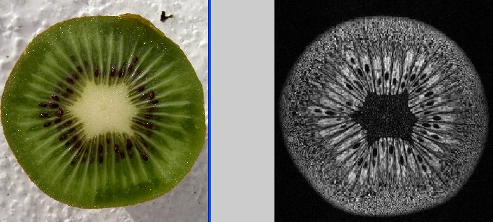

# In Vivo Imaging and Physiological Modelling - BMED 360 Spring 2021

## Midterm project:

### The KIWI fruit seed segmentation challenge

## [Problem formulation](https://docs.google.com/presentation/d/1B_E-Pcwfvj3hgG2o02vsxmez_Bm6x72uI5tzIu0dymU/edit?usp=sharing)

## [Data](https://github.com/computational-medicine/BMED360-2020/tree/master/midterm-project/data)

The 3D dataset, consisting of 128 transaxial slices through the long axis of
the kiwi, was acquired with the 7 T Bruker Pharmascan MRI scanner at the 
MIC / Vivarium, University of Bergen, using the 2D RARE pulse sequence
(Echo Train Length = 8, TR = 18520 ms, TE = 63.9 ms, No. of Averages = 2,
Flip Angle = 180 deg, Slice thickness = 0.5 mm, In-plane pixel resolution =
0.234 x 0.234 mm^2,  Acquisition matrix = 256 x 256, Number of slices = 128).

## Tentative methods
[Segment](https://en.wikipedia.org/wiki/Image_segmentation) the seeds from the background using all the clever tricks / ideas
you can come up with (e.g. adaptive thresholding, template matching /
a priori information, Fourier space methods, …).
Try out both 2D and 3D approaches.   [Use PYTHON, JAVA ([ImageJ](https://imagej.net/Welcome)/[Fiji](https://imagej.net/Fiji)/[MIPAV](https://mipav.cit.nih.gov) or MATLAB or …]

## Report
Write a **short scientific report** from your investigation, with a Title, an
“Introduction” with problem formulation, “Materials and methods” regarding
test object (kiwifruit), image acquisition and the image analysis methods
being used (your algorithm / code can be given in an Appendix);
“Experimental results” (seed counts for given algorithmic parameter settings, 
processing time, etc., use Figures and Tables to describe your results); 
“Discussion” (main results, strength and weaknesses of your approach,
suggestions for improvement, relevance to similar problems, conclusions).
“Bibliography” (try to find some relevant literature to this image analysis
task, and your algorithmic approach). Report should be sent by e-mail at
latest on the day before the 2nd period of the course.

