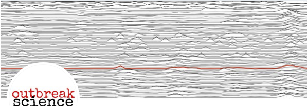

# In Vivo Imaging and Physiological Modelling - BMED 360 Spring 2021

# Ad hoc curriculum on COVID-19 and "outbreak science"
(work in progress)

#### We will keep substantial parts of the original curriculum (see [README](../README.md)), and extend those components that relates to "outbreak science", e.g. _the concept of modeling_, _diffusion_, _tracer kinetics_, _network science & graph theory_, _optimization_ ..., every topic supported by Jupyter notebooks (see below) - with programming exercises and challenges

## Course-related material and learning opportunities

  ### Book chapters
   - Selected chapters from Domingo WE. _Virus as Populations Composition, Complexity, Dynamics, and Biological Implications_. Academic Press, 2016. [[link](https://www.sciencedirect.com/book/9780128008379/virus-as-populations)]
   - [ _The Rules of Contagion: Why Things Spread - and Why They Stop_](http://kucharski.io/books) ([Basic Books](https://www.basicbooks.com/titles/adam-kucharski/the-rules-of-contagion/9781541674318), 2020) by [Adam Kucharski](https://www.lshtm.ac.uk/aboutus/people/kucharski.adam)
  
  ### Papers / Reviews
  - Adam D. _Special report: The simulations driving the world's response to COVID-19_ - How epidemiologists rushed to model the coronavirus pandemic. Nature (03 April 2020) [[online](https://www.nature.com/articles/d41586-020-01003-6)]
  - Drew DA, ..., Cardoso J, Ourselin S, ..., Chan A, COPE Consortium. _Rapid implementation of mobile technology for real-time epidemiology of COVID-19_. Science 2020 (first release 5 May 2020) [[online](https://science.sciencemag.org/content/early/2020/05/05/science.abc0473.full)] [[pdf](https://science.sciencemag.org/content/early/2020/05/05/science.abc0473/tab-pdf)] [[App details](https://science.sciencemag.org/content/sci/suppl/2020/05/04/science.abc0473.DC1/abc0473_Drew_SM.pdf)]
  - Ferretti L et al. _Quantifying SARS-CoV-2 transmission suggests epidemic control with digital contact tracing_. Science 2020 (first release 31 March 2020) [[online](https://science.sciencemag.org/content/early/2020/03/30/science.abb6936)] [[suppl](https://science.sciencemag.org/content/suppl/2020/03/30/science.abb6936.DC1)] [[pdf](https://science.sciencemag.org/content/early/2020/03/30/science.abb6936/tab-pdf)]
  - Houlihan CF, Whitworth JAG. _Outbreak science: recent progress in the detection and response to outbreaks of infectious diseases_. Clin Med (Lond). 2019 Mar;19(2):140–144  [[online](https://www.rcpjournals.org/content/clinmedicine/19/2/140)] [[pdf](https://www.rcpjournals.org/content/clinmedicine/19/2/140.full.pdf?download=true)]
  - Howard J, Thomas R. _Covid-19, your community, and you - a data science perspective_. [fast.ai](https://www.fast.ai) (9 Mar 2020) [[online](https://www.fast.ai/2020/03/09/coronavirus)]
  - Rivers C et al. _Using “outbreak science” to strengthen the use of models during epidemics_. Nat Commun 2019;10:3102 [[online](https://www.nature.com/articles/s41467-019-11067-2)] [[pdf](https://www.nature.com/articles/s41467-019-11067-2.pdf)]
  - Rivers C et al. Modernizing and Expanding Outbreak Science to Support Better Decision Making During Public Health Crises: Lessons for COVID-19 and Beyond. Report by The Johns Hopkins Center for Health Security, March 24, 2020 [[online](http://www.centerforhealthsecurity.org/our-work/publications/2020/modernizing-and-expanding-outbreak-science-to-support-better-decision-making-during-public-health-crises)] [[pdf](http://www.centerforhealthsecurity.org/our-work/pubs_archive/pubs-pdfs/2020/200324-outbreak-science.pdf)]

  ### Podcasts
  - **Science fights the coronavirus** [Exponential View*](https://www.exponentialview.co) with Azzem Azhar, [[talking (March 24 2020)](https://pca.st/episode/e069c865-d86d-4804-b5a8-7c75f7389d31)] with [Yaneer Bar-Yam](https://en.wikipedia.org/wiki/Yaneer_Bar-Yam), President of the New England Complex Systems Institute [* top channel, ignore the ads]
  
  ### Videos
  - **Simulating an Epidemic** The [3Blue1Brown](https://www.3blue1brown.com) animated math channel by [Grant Sanderson](https://en.m.wikipedia.org/wiki/3Blue1Brown)   (https://youtu.be/gxAaO2rsdIs)
  - **How is COVID-19 currently growing?** The [3Blue1Brown](https://www.3blue1brown.com) animated math channel by [Grant Sanderson](https://en.m.wikipedia.org/wiki/3Blue1Brown)   (https://youtu.be/Kas0tIxDvrg) -  see also his recent [TEDx talk](https://youtu.be/s_L-fp8gDzY) at UC Berkeley.
  - **GLEAMviz** The Global Epidemic and Mobility Model (http://www.gleamviz.org) [[video1](http://www.gleamviz.org/wp-content/themes/gleamviz-v3/banners/vision_940px_1024kbps.mp4)] [[video2](http://www.gleamviz.org/media/movies/map-demo-600-1500.mp4)] [[pdf1](http://prac.im.pwr.wroc.pl/~szwabin/assets/diff/8.pdf)] [[pdf2](http://prac.im.pwr.wroc.pl/~szwabin/assets/diff/9.pdf)]
  - **The MATH of Epidemics | Intro to the SIR Model** by [Trefor Bazett](https://www.uvic.ca/science/math-statistics/people/home/faculty/bazett_trefor.php) (https://youtu.be/Qrp40ck3WpI)
  - **The MATH of Epidemics | Variants of the SIR Model** by Trefor Bazett (https://youtu.be/f1a8JYAixXU)
  - **Oxford Mathematician explains SIR disease model for COVID-19 (Coronavirus)** by Tom Crawford (https://youtu.be/NKMHhm2Zbkw)
  - **How SARS-CoV-2 infects, sickens and kills people** by Benjamin Neuman, [The Conversation](https://theconversation.com/what-the-coronavirus-does-to-your-body-that-makes-it-so-deadly-133856) / Kurzgesagt – In a Nutshell (https://youtu.be/BtN-goy9VOY)
  - **How ventilators work** [video at [STATnews](https://www.statnews.com/2020/04/21/coronavirus-analysis-recommends-less-reliance-on-ventilators/?jwsource)]. For [pathophysiology](https://en.wikipedia.org/wiki/Pathophysiology) of COVID-19, see also the review by A.M. Dondorp et al. _Respiratory support in novel coronavirus disease (COVID-19) patients, with a focus on resource-limited settings_. Am J Trop Med Hyg.  April 21, 2020   [[onlline](https://www.ajtmh.org/content/journals/10.4269/ajtmh.20-0283)] [[pdf](https://www.ajtmh.org/deliver/fulltext/10.4269/ajtmh.20-0283/tpmd200283.pdf?itemId=%2Fcontent%2Fjournals%2F10.4269%2Fajtmh.20-0283&mimeType=pdf&containerItemId=content/astmh)]
  - **Lessons learned (or, may be not)** The next outbreak? We’re not ready, [TED talk](https://www.ted.com) by Bill Gates, Apr 3 2015 (https://youtu.be/6Af6b_wyiwI)
  
  ### Web sites
   - **WHO Coronavirus disease (COVID-19) Pandemic** (https://www.who.int/emergencies/diseases/novel-coronavirus-2019)
   - **Johns Hopkins University CORONAVIRUS RESOURCE CENTER** (https://coronavirus.jhu.edu) see also https://github.com/CSSEGISandData/COVID-19
   - **Highlights of Expert Panel on COVID-19 from Harvard, MIT, Mass General Hospital** (https://www.justsecurity.org/69202/highlights-of-expert-panel-on-covid-19-from-harvard-mit-mass-general)
   - **COVID Scholar from the Lawrence Berkeley National Laboratory** COVID-19 literature search [powered](https://covidscholar.org/about) by advanced [NLP](https://en.wikipedia.org/wiki/Natural_language_processing) algorithms (https://covidscholar.org)
  
  ### Data and challenges (for educational use)
   - **Fighting Covid-19 Challenge** Medical imaging is potentially well suited for Covid-19 diagnosis. "This challenge is about connecting the best brains to support doctors with artificial intelligence systems" (https://www.covid19challenge.eu)
   - **#Hack the Crisis Norway** A 48-hour challenge March 27th–29th (https://www.hackthecrisisnorway.com) see also [EU-Startups](https://www.eu-startups.com/2020/03/apply-by-midnight-tonight-to-join-the-online-covid-19-hackathon-run-by-the-norweigan-tech-community)
   - **COVID-19 Open Research Dataset Challenge (CORD-19)** An AI challenge with AI2, CZI, MSR, Georgetown, NIH & The White House (https://www.kaggle.com/allen-institute-for-ai/CORD-19-research-challenge)
   - **Raw data in Wuhan, Hubei, and Guangzhou for serious COVID-19 cases, and Wuhan hospitalization data** Center for Communicable Disease Dynamics – Harvard University (https://github.com/c2-d2/COVID-19-wuhan-guangzhou-data)
   - **coronastatus** Open source webapp that let people report their health status to get overview of COVID-19 (https://github.com/BustByte/coronastatus)
   - **sars-cov-2** Here are 65 public repositories matching this topic ... from the [neherlab](https://neherlab.org)
Computational biology at the Biozentrum, Basel: https://github.com/topics/sars-cov-2. See also [covid19_scenarios](https://github.com/neherlab/covid19_scenarios) and [covid19_scenarios_data](https://github.com/neherlab/covid19_scenarios_data)
   - **COVID-19 Datasets for Machine Learning** (curated Google Docs list by [Mila](https://docs.google.com/document/d/1Wkvbf2t2Da87NtNvMJf_PRqv9zLHyqqtRitBIGGKKNM/edit#))
   - **Introduction to Computational Thinking with Julia, with applications to modelling the COVID-19 pandemic** mitmath/6S083: Materials for MIT 6.S083 / 18.S190; Spring 2020 (https://github.com/mitmath/6S083)
 

### Online slides (and some tools)

 - **COVID-19 Videos** from International SOS (https://pandemic.internationalsos.com/2019-ncov/covid-videos)
 - **COVID-19 - What you need to know** International SOS [[ppt](https://pandemic.internationalsos.com/-/media/pandemic/files/pan-comms-new-corona-virus/intlsos-coronavirus-disease-2019talksimplifiedv51.pptx?la=en)]
 - **Learning from 26,000 cases of COVID-19 in Wuhan** (20 Mar 2020) by Xihong Lin, Biostatistics, Broad Institute of Harvard and MIT [[google slides](https://docs.google.com/presentation/d/1-rvZs0zsXF_0Tw8TNsBxKH4V1LQQXq7Az9kDfCgZDfE/mobilepresent?slide=id.p1)]
 - **COVID-19 Presentation** - Free Google Slides theme and PowerPoint template (https://slidesgo.com/theme/covid-19)
 - **Teach (and learn) from Home** - tools and tips Google/Unesco (https://teachfromhome.google/intl/en) /  (https://en.unesco.org/covid19/educationresponse/solutions)

## Computer labs (on GitHub)
 - biology ([bio](./bio/README_bio.md))
 - epidemiology ([epi](./epi/README_epi.md))
 - spatio-temporal geographical information / cartography ([geo](./geo/README_geo.md))
 - imaging ([img](./img/README_img.md)) 

Last updated: 10 May 2020 (A.L)
