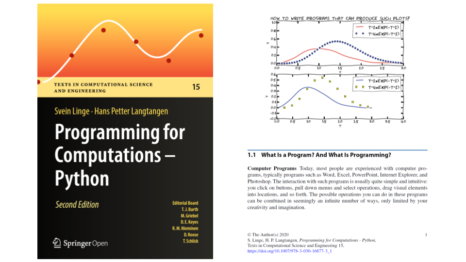

# prog4comp-SL-HPL

This directory is derived from https://github.com/slgit/prog4comp_2 (licensed under the GNU General Public License v3.0) beeing source code in python 3.6 associated with the famous book by

#### Svein Linge & the late [Hans Petter Langtangen](http://hpl-memorial.simula.no):  "*Programming for Computations - Python: A Gentle Introduction to Numerical Simulations with Python 3.6*"

now in its 2nd edition (2020) and made [Open Access](https://link.springer.com/book/10.1007%2F978-3-030-16877-3) [[pdf](https://link.springer.com/content/pdf/10.1007%2F978-3-030-16877-3.pdf)] by Springer International Publishing AG under the terms of the Creative Commons Attribution-NonCommercial 4.0 International License (http://creativecommons.org/licenses/by-nc/4.0)

 

*The book outlines the shortest possible path from no previous experience with programming to a set of skills that allows the students to write simple programs for solving common mathematical problems with numerical methods in engineering and science courses. The emphasis is on generic algorithms, clean design of programs, use of functions, and automatic tests for verification.* 

***

#### From the **Preface**

Computing, in the sense of doing mathematical calculations, is a skill that mankind has developed over thousands of years. Programming, on the other hand, is in its infancy, with a history that spans a few decades only. Both topics are vastly comprehensive and usually taught as separate subjects in educational institutions around the world, especially at the undergraduate level. This book is about the combination of the two, because computing today becomes so much more powerful when combined with programming.

Most universities and colleges implicitly require students to specialize in computer science if they want to learn the craft of programming, since other student programs usually do not offer programming to an extent demanded for really mastering this craft. Common arguments claim that it is sufficient with a brief introduction, that there is not enough room for learning programming in addition to all other must-have subjects, and that there is so much software available that few really need to program themselves. A consequence is that engineering students [and in (bio)medicine] often graduate
with shallow knowledge about programming, unless they happened to choose the
computer science direction.

We think this is an unfortunate situation. There is no doubt that practicing engineers and scientists need to know their pen and paper mathematics. They must also be able to run off-the-shelf software for important standard tasks and will certainly do that a lot. Nevertheless, the benefits of mastering programming are many

#### Why learn programming?

1. Ready-made software is limited to handling certain standard problems. What do
you do when the problem at hand is not covered by the software you bought?
Fortunately, a lot of modern software systems are extensible via programming. In fact, many systems demand parts of the problem specification (e.g., material models) to be specified by computer code.
2. With programming skills, you may extend the flexibility of existing software packages by combining them. For example, you may integrate packages that do not speak to each other from the outset. This makes the work flow simpler, more efficient, and more reliable, and it puts you in position to attack new problem
3. It is easy to use excellent ready-made software the wrong way. Insight in
programming and the mathematics behind is fundamental for understanding
complex software, avoiding pitfalls, and become a safe user.
4. Bugs (errors in computer code) are present in most larger computer programs (also in the ones from the shop!). What do you do when your ready-made software gives unexpected results? Is it a bug, is it wrong use, or is it the mathematically correct result? Experience with programming of mathematics gives you a good background for answering these questions. The one who can program, can also make tailored code for a simplified problem setting and use that to verify the computations done with off-the-shelf software.
5. Lots of skilled people around the world solve computational problems by writing their own code and offer their code for free on the Internet. To take advantage of this truly great source of software in a reliable way, one must normally be able to understand and possibly modify computer code offered by others.
6. It is recognized world wide that students struggle with mathematics and physics. Too many find such subjects difficult and boring. With programming, we can execute the good old subjects in a brand new way! According to the authors’ own experience, students find it much more motivating and enlightening when programming is made an integrated part of mathematics and physical science courses. In particular, the problem being solved can be much more realistic than when the mathematics is restricted to what you can do with pen and paper.
7. Finally, we launch our most important argument for learning computer programming: the *algorithmic thinking* that comes with the process of writing a program for a computational problem enforces a thorough understanding of both the problem and solution method. We can simply quote the famous Norwegian computer scientist [Kristen Nygaard](https://en.wikipedia.org/wiki/Kristen_Nygaard): “Programming is understanding”.

***

#### Some relevant topics for the BMED360 course

- 1.1 - What Is a Program? And What Is Programming? (read the section [The First Few Steps](https://link.springer.com/content/pdf/10.1007%2F978-3-030-16877-3_1.pdf))
- 1.2 - A Python Program with Variables [[ball](./src/ball.py)]
- 1.3 - A Python Program with a Library Function [[ball_angle_first_try](./src/ball_angle_first_try.py)] [[ball_angle](./src/ball_angle.py)] [[ball_angle_prefix](./src/ball_angle_prefix.py)]
- 1.4 - Importing from Modules and Packages (read the section [The First Few Steps](https://link.springer.com/content/pdf/10.1007%2F978-3-030-16877-3_1.pdf))
- 1.5 - A Python Program with Vectorization and Plotting [[ball_plot](./src/ball_plot.py)]
- 2.2 - Variables, Objects and Expressions  (read the section [A Few More Steps](https://link.springer.com/content/pdf/10.1007%2F978-3-030-16877-3_2.pdf))
- 2.3 - Numerical Python Arrays [[Quickstart tutorial](https://docs.scipy.org/doc/numpy/user/quickstart.html)]
- 2.4 - Random Numbers [[throw_2_dice](./src/throw_2_dice.py)]
- 3.1 - The `for` loop [[average_height](./src/average_height.py)] [[time_tables_4](./src/time_tables_4.py)]
- 3.2 - The `while` loop [[ball_plot](./src/ball_plot.py)]
- 3.3 - Branching (`if`, `elif` and `else`)  [[swim_advisor](./src/swim_advisor.py)]
- 4.1 - Functions: How to Write Them? [[ball_function](./src/ball_function.py)] [[ball_position_xy](./src/ball_position_xy.py))] [[function_as_argument](./src/function_as_argument.py)]
- 5.3 - Symbolic Computations [[example_symbolic](./src/example_symbolic.py)]
- 5.4 - Making Our Own Module [[vertical_motion](./src/vertical_motion.py)]
- 5.5 - Files: Read and Write [[file_handling](./src/file_handling.py)]
- 8.2 - Population Growth: A First Order ODE [[growth1](./src/growth1.py)] (read the section [Solving Ordinary Differential Equations](https://link.springer.com/content/pdf/10.1007%2F978-3-030-16877-3_8.pdf) and watch the *3blue1brown* YouTube [videos](https://www.youtube.com/playlist?list=PLZHQObOWTQDNPOjrT6KVlfJuKtYTftqH6) by Grant Sanderson)
- 8.3 - Spreading of Disease: A System of First Order ODEs [[SIR1](./src/SIR1.py)] [[SIR2](./src/SIR2.py)] [[SIRV1](./src/SIRV1.py)] [[SIRV2](./src/SIRV2.py)]
- 9.1 - Example: Temperature Development in a Rod (*diffusion*) [[random_walk_2D](./src/random_walk_2D.py)] [[rod_FE](./src/rod_FE.py)] [[rod_FE_scaled](./src/rod_FE_scaled.py)]
- 9.2 - Finite Difference Methods [[test_diffusion_pde_exact_linear](./src/test_diffusion_pde_exact_linear)] [[rod_FE_vec](./src/rod_FE_vec.py)] (read the section [Solving Partial Differential Equations](https://link.springer.com/content/pdf/10.1007%2F978-3-030-16877-3_9.pdf))

***

**NOTE**: If you install Anaconda (as you have), the only additional package you "need" (i.e. recommended*) for running all the software in the present book, is `Odespy`(https://github.com/thomasantony/odespy/tree/py36/odespy) to demonstrate how ordinary differential equations alternatively may be solved with ready-made software.

*) only `NumPy`, `Matplotlib`, `IPython`, and `SymPy` (symbolic mathematics) are required

You will frequently also need `SciTools` (https://github.com/hplgit/scitools) - a Python package containing lots of useful tools for scientific computing in Python. 
This is Python 2.7, so you will need `SciTools3` (https://github.com/onnoeberhard/scitools3) with installion `pip install scitools3` (none of these are maintained).

***

Trying to convert selected .py files to .ipynb using [ipynb-py-convert](https://github.com/kiwi0fruit/ipynb-py-convert)

`conda install -c defaults -c conda-forge ipynb-py-convert`

e.g.

`ipynb-py-convert src/Newton_demo.py notebooks/Newton_demo.ipynb`
